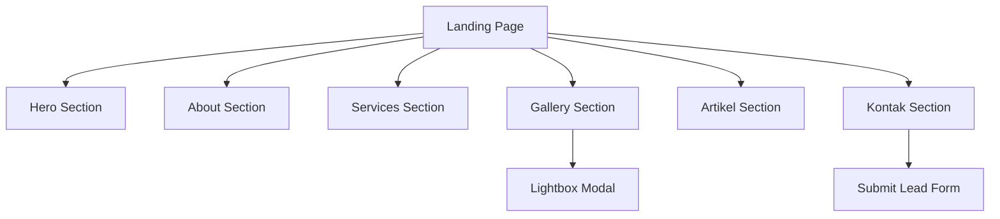

## 1. Product Overview
Landing page Trace Agency bergaya dark, photo-centric, dengan fokus utama galeri grid/masonry.
Tujuan: memperkenalkan agency, menampilkan portofolio visual, dan mengubah pengunjung menjadi lead via kontak.

## 2. Core Features

### 2.1 Feature Module
1. **Landing Page Trace Agency**: navigasi anchor ke section, Hero, About, Services, Gallery masonry + lightbox, Artikel (teaser), Kontak (form), footer.

### 2.3 Page Details
| Page Name | Module Name | Feature description |
|-----------|-------------|---------------------|
| Landing Page Trace Agency | Header / Navigasi | Menampilkan logo + menu anchor (Hero/About/Services/Gallery/Artikel/Kontak) dan tombol CTA “Konsultasi”. |
| Landing Page Trace Agency | Hero | Menampilkan headline, subheadline, CTA utama, background foto (placeholder Unsplash), dan animasi masuk halus. |
| Landing Page Trace Agency | About | Menjelaskan ringkas profil/keunggulan Trace Agency dalam format teks + foto/kolase. |
| Landing Page Trace Agency | Services | Menampilkan daftar layanan utama dalam kartu: judul, deskripsi singkat, ikon (lucide-react). |
| Landing Page Trace Agency | Gallery (Masonry-First) | Menampilkan galeri foto dengan layout masonry/grid; aksi: hover reveal (judul/kategori), buka lightbox modal, navigasi next/prev, close. |
| Landing Page Trace Agency | Artikel | Menampilkan teaser artikel: 1 featured + beberapa kartu ringkas (judul, ringkasan, tanggal, cover Unsplash). |
| Landing Page Trace Agency | Kontak | Menyediakan form lead: nama, email/WA, kebutuhan singkat; validasi wajib; tombol kirim; state sukses/gagal. |
| Landing Page Trace Agency | Footer | Menampilkan info singkat, link anchor, sosial, dan copyright. |

## 3. Core Process
Alur Pengunjung:
1) Pengunjung membuka landing page dan melihat Hero + CTA.
2) Pengunjung men-scroll untuk memahami About dan memilih layanan pada Services.
3) Pengunjung mengeksplor Gallery (hover untuk info, klik membuka lightbox, melihat beberapa foto).
4) Pengunjung membaca ringkasan pada Artikel untuk membangun trust.
5) Pengunjung mengisi form Kontak untuk mengirim kebutuhan (lead).

