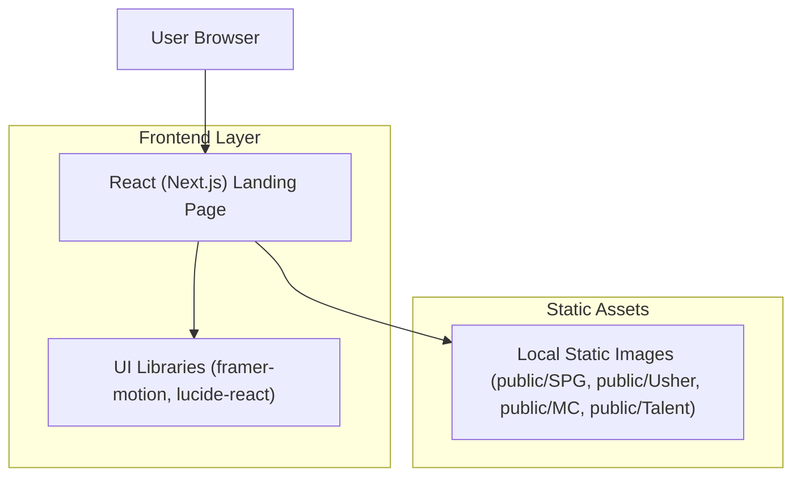

## 1.Architecture design

## 2.Technology Description
- Frontend: React@18 + Next.js + framer-motion + lucide-react
- Backend: None (gambar carousel menggunakan aset lokal; form kontak bisa dummy/mailto untuk MVP)

## 3.Route definitions
| Route | Purpose |
|-------|---------|
| / | Landing page Trace Agency (Hero/About/Services/Gallery/Artikel/Kontak) |
